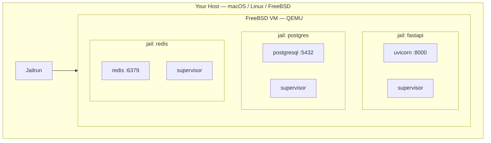
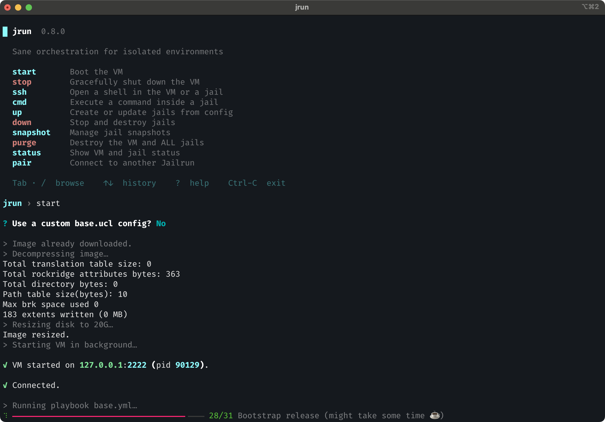
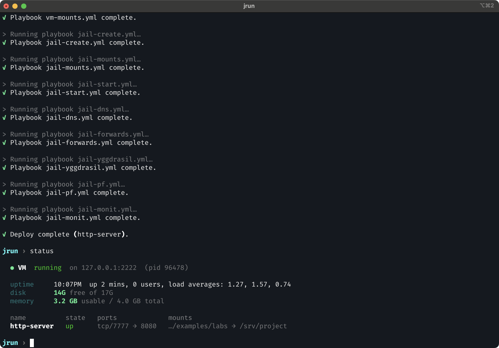

# Quick start

## Why Jailrun?

Running services locally often means juggling multiple tools, conflicting dependencies, and environments that interfere with each other. One project needs one setup, another needs a different one, and over time your host machine becomes harder to keep clean and predictable.

Jailrun lets you describe your services in a declarative config file, and brings the system to that state. Under the hood, it boots a FreeBSD virtual machine on your host using QEMU with hardware acceleration.

## What is a jail?

A jail is a self-contained environment running inside FreeBSD. Each jail is isolated from the host and from other jails, with its own filesystem, network, and processes.

Jails are a native FreeBSD feature. They are fast to create, cheap to run, and easy to destroy and recreate from scratch. FreeBSD jails are one of the most proven isolation technologies in computing, and Jailrun makes them accessible from macOS, Linux, and FreeBSD itself.



## Start and bring it up

Create a file called `web.ucl`:

```
jail "http-server" {
  forward {
    http { host = 7777; jail = 8080; }
  }
  mount {
    src { host = "."; jail = "/srv/project"; }
  }
  exec {
    server {
      cmd = "python3.13 -m http.server 8080";
      dir = "/srv/project";
    }
  }
}
```

This declares a jail that mounts your current directory, forwards port 7777 to 8080, and runs a supervised Python HTTP server inside.

Launch the interactive shell:

```bash
jrun
```

From here, select **start** to boot the VM. On first run it downloads the FreeBSD image and bootstraps the base system:



Once the VM is running, select **up** and pick your config file to deploy the jail. Jailrun creates the jail, mounts your code, wires up the ports, and starts the supervised processes.



If you change the config later — like changing a forwarded port or mounting another directory — just run **up** again.

## Smoke test

```bash
curl -sS localhost:7777
```

You should see your project files served back.

## Check status

Select **status** from the shell:


## Interactive shell

The interactive shell provides guided wizards, autocomplete, and command history — it walks you through everything `jrun` can do.

!!! tip

    If you prefer scripting or already know the command you need, every action is also available directly — e.g. `jrun start`, `jrun up web.ucl`, `jrun status`. See [CLI reference](../reference/cli.md) for the full list.
