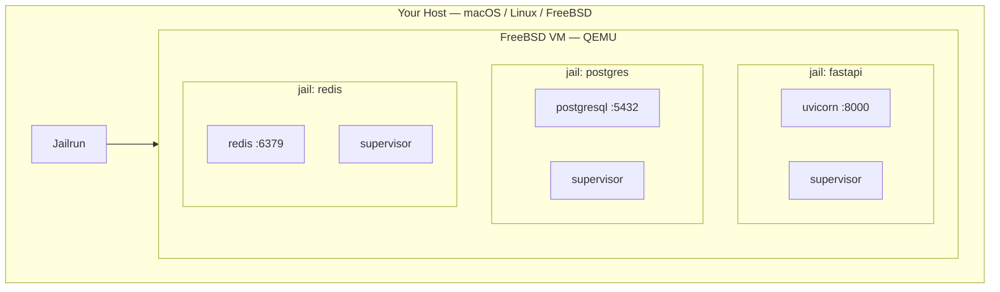
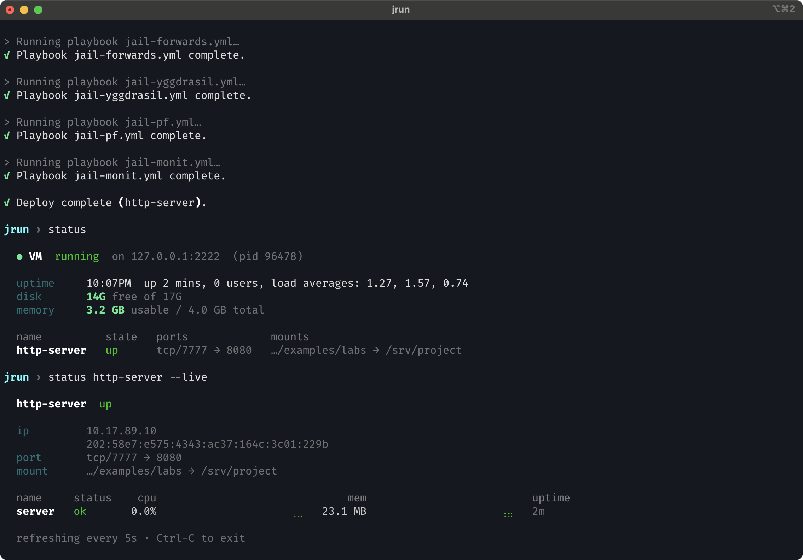

# Quick start

## Why Jailrun?

Running services locally often means juggling multiple tools, conflicting dependencies, and environments that interfere with each other. One project needs one setup, another needs a different one, and over time your host machine becomes harder to keep clean and predictable.

Jailrun solves this by booting a FreeBSD virtual machine on your host using QEMU with hardware acceleration. Everything runs inside that VM — completely isolated from your host system.

Inside the VM, Jailrun creates jails — lightweight, isolated environments for running your services.

## What is a jail?

A jail is a self-contained environment running inside FreeBSD. Each jail is isolated from the host and from other jails, with its own filesystem, network, and processes.

Jails are a native FreeBSD feature. They are fast to create, cheap to run, and easy to destroy and recreate from scratch. FreeBSD jails are one of the most proven isolation technologies in computing, and Jailrun makes them accessible from macOS, Linux, and FreeBSD itself.



## Declarative configuration

Jailrun is an orchestration tool. You describe the desired state in a config file — which jails to create, what to install, which ports to forward, what processes to run — and `jrun` brings the system to that state.

Create a file called `web.ucl`:

```
jail "httpserver" {
  forward {
    http { host = 7777; jail = 8080; }
  }
  mount {
    src { host = "."; jail = "/srv/project"; }
  }
  exec {
    server {
      cmd = "python3.13 -m http.server 8080";
      dir = "/srv/project";
    }
  }
}
```

This declares a jail that mounts your current directory, forwards port 7777 to 8080, and runs a supervised Python HTTP server inside.

## Start and bring it up

Boot the VM (downloads the FreeBSD image and bootstraps on first start):

```bash
jrun start
```

Deploy the jail:

```bash
jrun up web.ucl
```

Behind the scenes, jrun creates the jail, mounts your code, wires up the ports, and starts the process. If the process crashes, it is restarted automatically.

If you change the config later — like changing a forwarded port or mounting another directory — just `jrun up` it again.

## Smoke test

```bash
curl -sS localhost:7777
```

You should see your project files served back.

## Check status

```bash
jrun status
```



## Interactive shell

Don't want to remember commands? Run `jrun` with no arguments:

```bash
jrun
```

This launches an interactive shell with guided wizards, autocomplete, and command history — it walks you through everything `jrun` can do.
