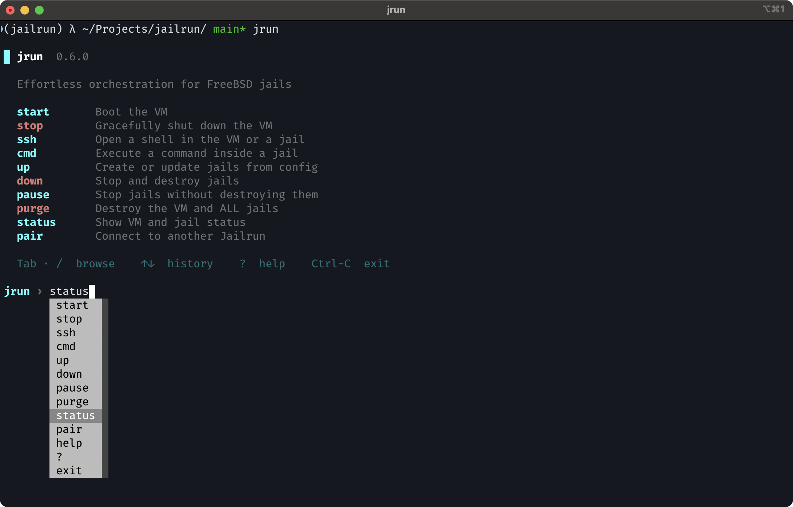

# jrun

Start the interactive shell.

```bash
jrun
```

Launches a guided CLI with autocomplete, command history, and built-in wizards. From here you can manage the VM, create and destroy jails, check status, and run commands — all without memorising flags.

## Usage

Running `jrun` with no arguments enters the shell.



!!! tip

    If you prefer scripting or already know the command you need, every action is also available directly — e.g. `jrun start`, `jrun up`, `jrun status`. See [CLI commands](cli.md) for the full list.
