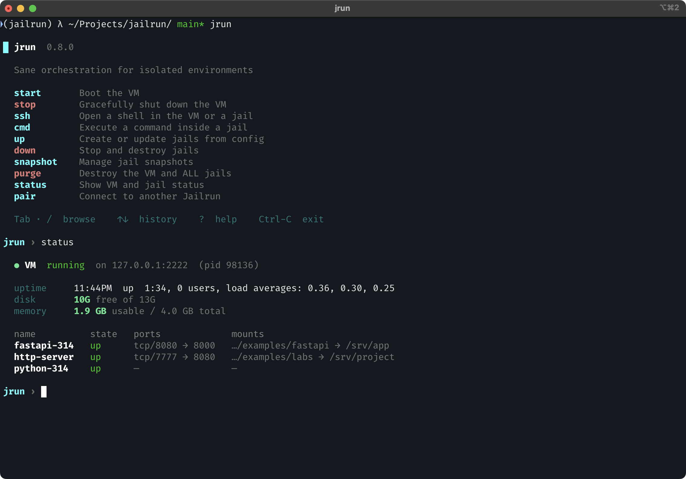
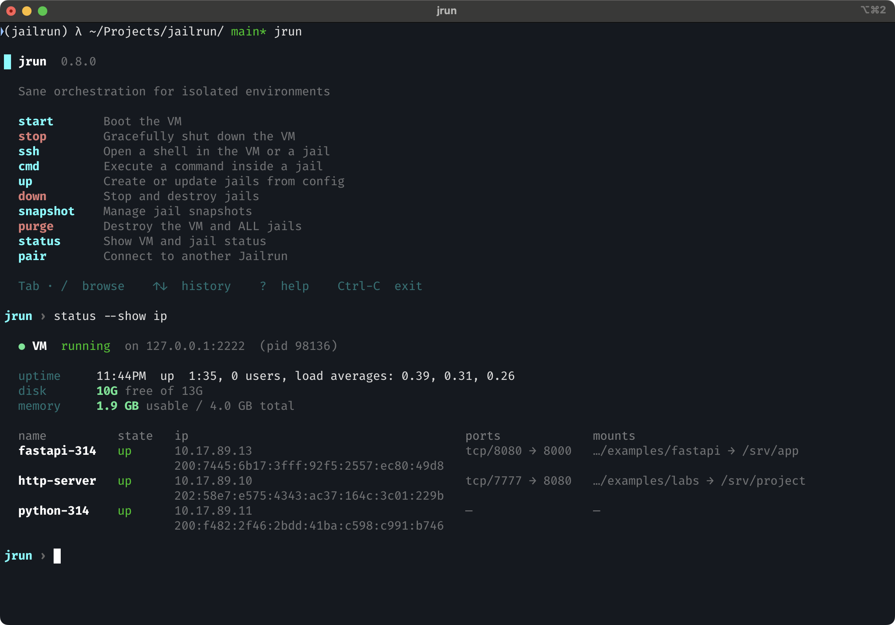
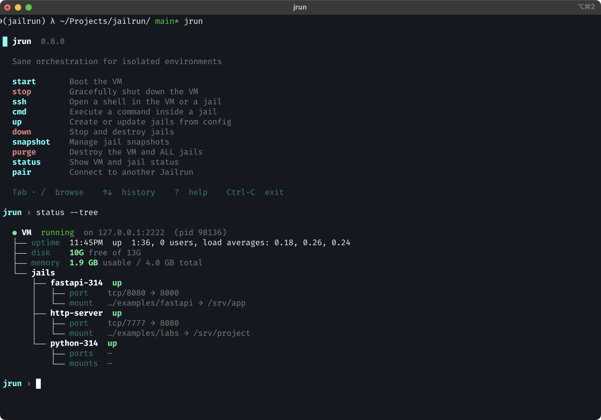
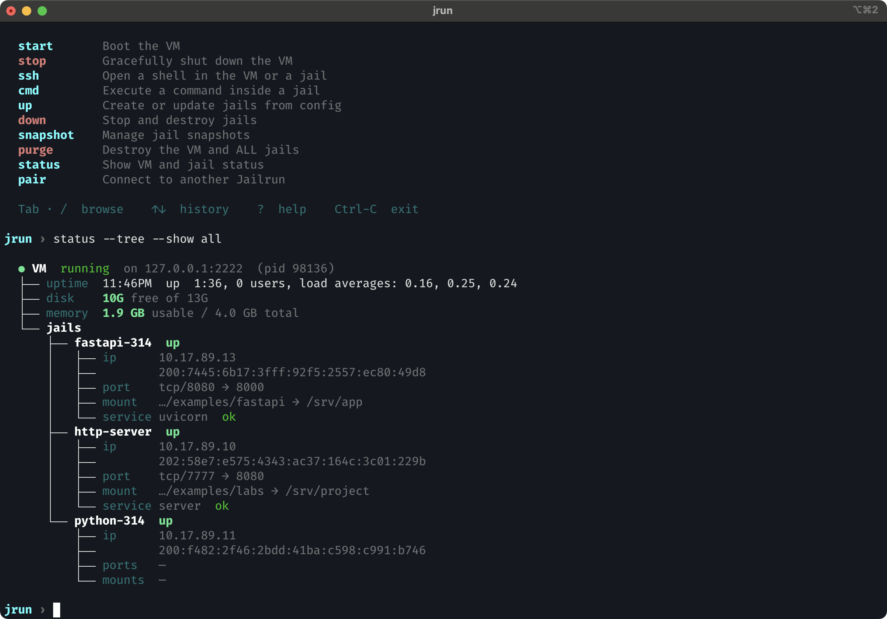
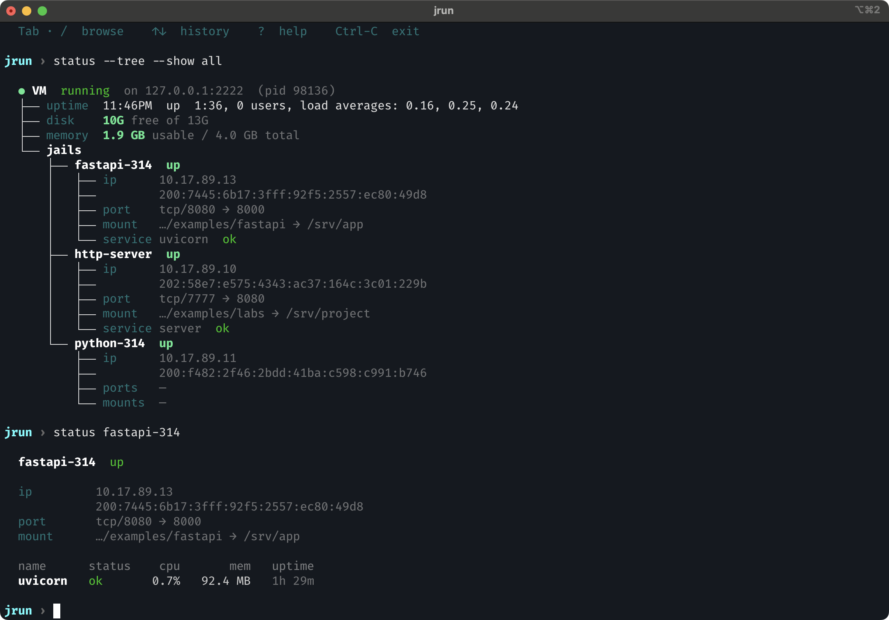
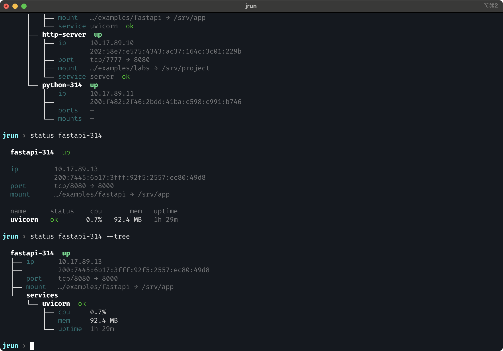
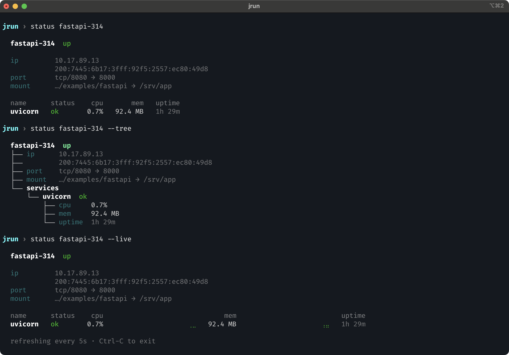
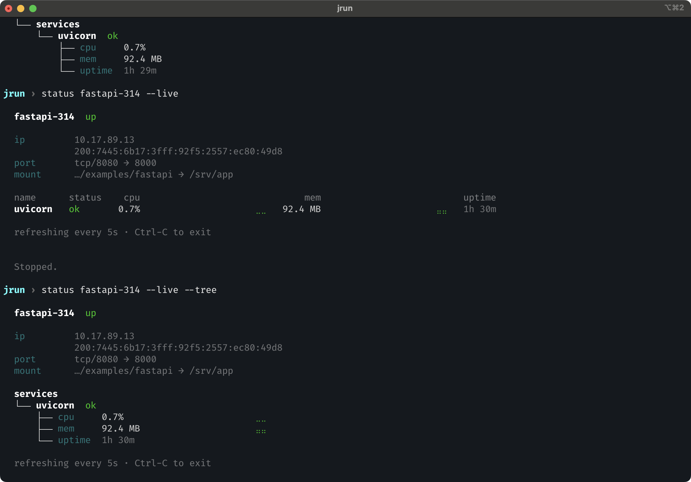

# jrun status

Show VM and jail status.

## Overview

```bash
jrun status
```



## Extra columns

Use `--show` / `-s` to add columns to the overview table.

```bash
jrun status --show ip
jrun status --show services
jrun status --show ip --show services
jrun status --show all                  # shorthand for ip + services
```



## Tree view

```bash
jrun status --tree
```



Tree view also respects `--show`:

```bash
jrun status --tree --show all
```



This adds `ip` rows and `service` rows to each jail node.

## Jail detail

Pass a jail name to see its full detail view:

```bash
jrun status fastapi-314
```




The detail view shows monit service metrics (cpu, mem, uptime) when available.

### Detail tree view

```bash
jrun status fastapi-314 --tree
```



## Live monitor

Watch service metrics in real time with CPU and memory sparklines:

```bash
jrun status fastapi-314 --live
```



The display refreshes every 5 seconds. Sparklines show the last 20 samples.

### Live tree view

```bash
jrun status fastapi-314 --live --tree
```

Same data rendered as a tree instead of a table, with sparklines inline next to each metric.



## Options

| Flag | Short | Description |
|------|-------|-------------|
| `--tree` | `-t` | Render as tree instead of table |
| `--show` | `-s` | Extra columns: `ip`, `services`, `all` |
| `--live` | `-l` | Live service monitor with sparklines (requires jail name) |
