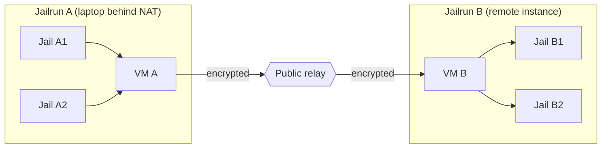
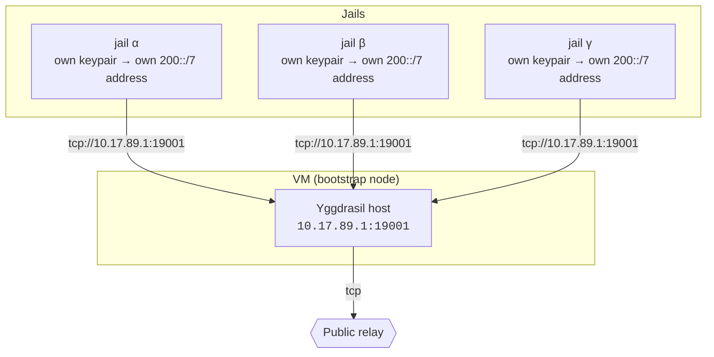
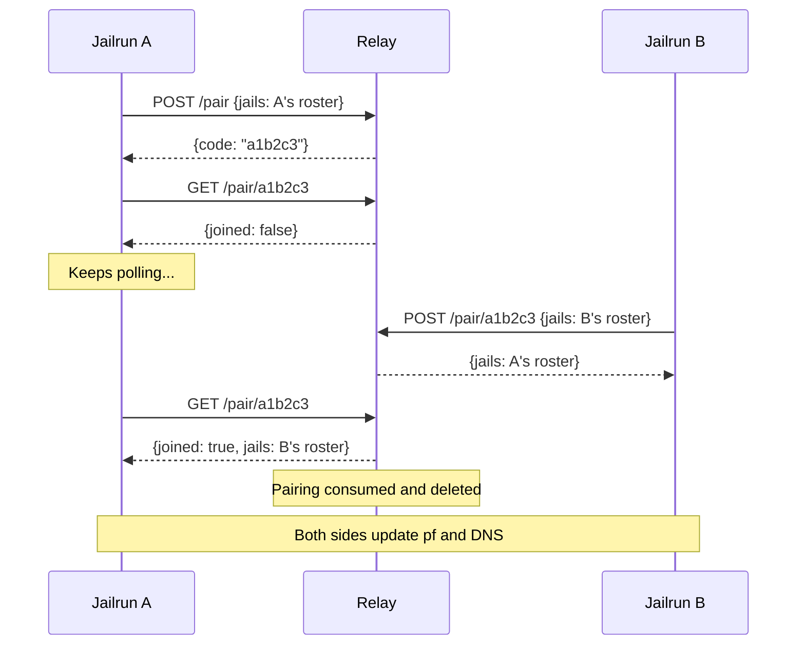
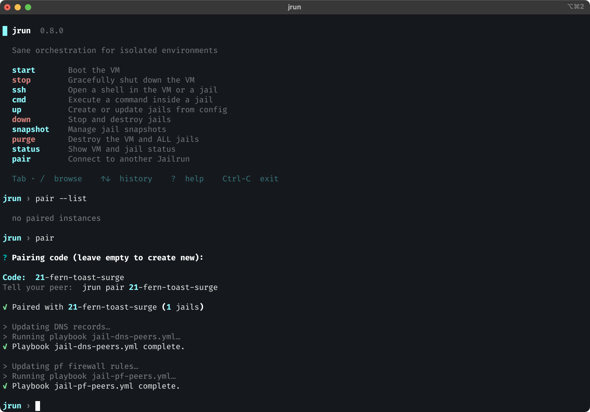
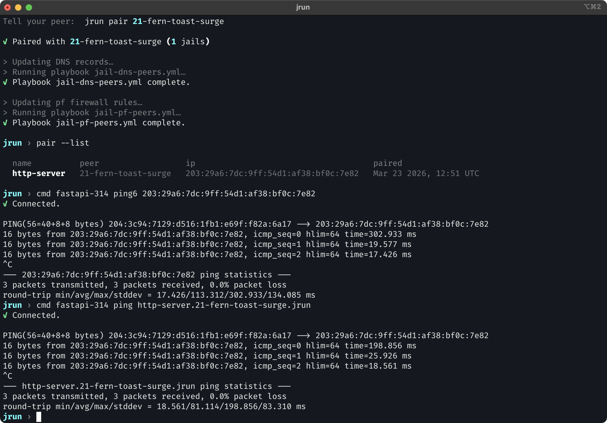
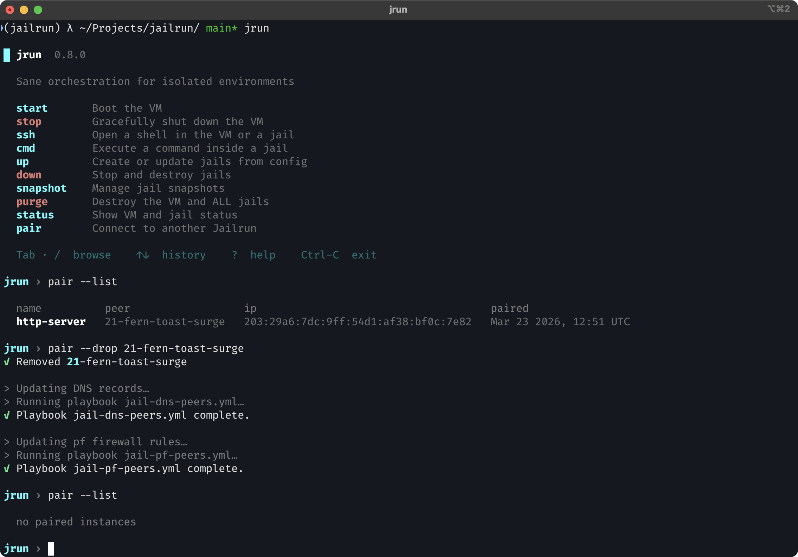

# Mesh

Every jail in Jailrun is more than an isolated sandbox — it is a globally unique network identity. Each jail holds its own cryptographic keypair and can be reached by a stable IPv6 address that belongs to it alone, regardless of where the host machine sits on the Internet.

Jailrun instances can **pair** with each other to form a private encrypted mesh. After pairing, every jail on one machine can reach every jail on the other, and vice versa. There is nothing to configure on a per-jail basis — it just works.

## Why this matters

A few things this makes possible:

- **Collaborate with a teammate** while both of you work locally, then test integrations together in real time. Your jails see each other's jails as if they shared one environment.
- **Connect a local app to a remote database** running in a jail on another host — no tunnels, no port forwarding, no VPN setup.
- **Span a dev environment across machines.** Run your frontend locally and point it at a backend jail on a remote server. DNS names resolve, connections go through, firewalls stay tight.

## How it works

Jailrun builds its mesh on top of [Yggdrasil](https://yggdrasil-network.github.io/), an encrypted IPv6 overlay network. Every participant — the VM and each jail inside it — runs its own Yggdrasil node and gets a `200::/7` address derived from its public key. These addresses are permanent, globally unique, and not tied to any physical network.

**All traffic on this path is end-to-end encrypted between the two jails.** The VMs and the relay route it, but cannot read it. The VM acts as a **bootstrap node**. It runs Yggdrasil on the jail bridge (`10.17.89.1:19001`) and peers with the public relay:

## The relay

Both machines need a common point to find each other. This is especially important when one or both are behind NAT, where direct connections are impossible without assistance.

The relay is a lightweight service with two jobs: it acts as a Yggdrasil peer so that nodes behind NAT can route traffic through it, and it exposes a small HTTP API that coordinates the pairing handshake. It does not store any long-lived state and never sees encryption keys.

Hypha, the company behind Jailrun, runs a free public relay at `relay.jail.run` that every Jailrun instance uses by default. You do not need to create an account or configure anything.

The relay is [open source](https://github.com/hyphatech/jailrun-relay). You can run your own if you prefer full control over the handshake on your infrastructure, or implement a compatible relay from scratch — the API surface is three endpoints only.

## Pairing

Pairing is how two Jailrun instances agree to let their jails talk to each other. It is a short handshake coordinated through the relay:

1. **One side creates a pairing** with `jrun pair create`. Jailrun collects the Yggdrasil address of every running jail and sends the roster to the relay, which returns a short code.
2. **The other side joins** with `jrun pair <code>`. It sends its own jail roster to the relay and receives the first side's roster in return.
3. **Both sides update their firewalls and DNS** to allow and resolve the newly paired jails.

After pairing, each side knows the Yggdrasil addresses of the other's jails and opens the firewall for exactly those addresses — nothing more.

Side A creates a pairing and receives a short code, then polls the relay waiting for someone to join. Side B posts its jail roster to the same code and immediately receives A's roster. On A's next poll, the relay returns B's roster and deletes the pairing — the code cannot be reused.

## Identity

Each jail's Yggdrasil keypair is generated once, on first deploy, and persisted on disk. This means a jail's `200::/7` address is stable across restarts, redeploys, and reboots. Peers that have already paired with it do not need to re-pair.

## Access control

Mesh traffic is **blocked by default**. Every jail runs its own instance of [pf](https://docs.freebsd.org/en/books/handbook/firewalls/#firewalls-pf), and the default ruleset drops all inbound Yggdrasil traffic. Pairing is the only mechanism that opens the firewall, and it does so selectively — only the specific `200::/7` addresses exchanged during the handshake are whitelisted.

In short: if two Jailrun instances are not paired, their jails cannot reach each other over the mesh — even though they may share the same relay. The overlay network provides connectivity and `pf` provides the policy.

## Example

Two machines (a laptop behind NAT and a remote server) each running Jailrun with a couple of jails deployed.

Create a pairing on one side and share the code with your peer:

Once the handshake completes, jails on both sides can reach each other directly by IPv6 address or by fully qualified name:

To tear down a pairing and revoke all access:

