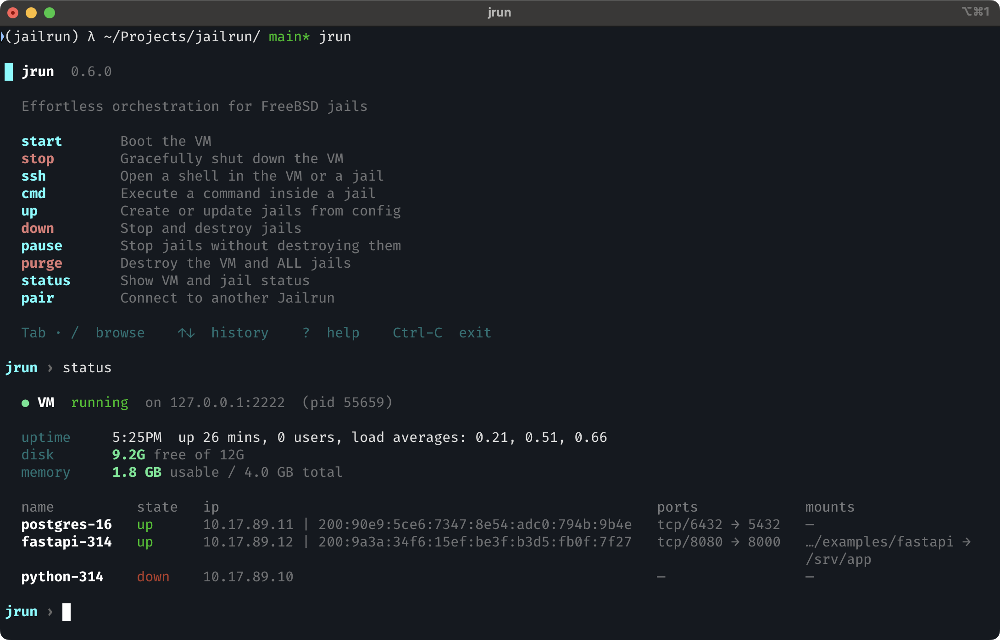

# Wiring together

Let's build something real — a FastAPI application on Python 3.14, backed by PostgreSQL. Three jails, each doing one thing, all wired together.

## The config

The complete project files are in the [repo examples](https://github.com/hyphatech/jailrun/tree/main/examples/fastapi).

Create a file called `stack.ucl`:

```
jail "python-314" {
  setup {
    python { type = "ansible"; file = "playbooks/python-314.yml"; }
  }
}

jail "postgres-16" {
  setup {
    postgres { type = "ansible"; url = "hub://postgres/16"; }
  }
  forward {
    pg { host = 6432; jail = 5432; }
  }
}

jail "fastapi-314" {
  base { type = "jail"; name = "python-314"; }

  depends ["postgres-16"]

  setup {
    fastapi { type = "ansible"; file = "playbooks/fastapi-314.yml"; }
  }
  forward {
    http { host = 8080; jail = 8000; }
  }
  mount {
    src { host = "."; jail = "/srv/app"; }
  }
  exec {
    httpserver {
      cmd = "python3.14 -m uvicorn app:app --reload";
      dir = "/srv/app";
      healthcheck {
        test = "fetch -qo /dev/null http://127.0.0.1:8000";
        interval = "30s";
        timeout = "10s";
        retries = 5;
      }
    }
  }
}
```

## Bring it up

```bash
jrun up stack.ucl
```

Or run `jrun` with no arguments and the wizard will guide you through picking the config file.

## What's happening

**Jailrun uses [Ansible](https://docs.ansible.com/) for provisioning** — every `setup` block points to a playbook that runs when the jail is first created.

The `hub://` scheme tells jrun to pull the playbook from [Jailrun Hub](https://github.com/hyphatech/jailrun-hub) — a curated collection of playbooks for common services like PostgreSQL, Redis, Nginx, and more. You can mix remote playbooks with your own local ones, composing layer by layer. In this config, `postgres-16` uses a Jailrun Hub playbook while `python-314` and `fastapi-314` use local ones.

Compiling from source can be slow. You do it once in `python-314`, then `fastapi-314` is created as its clone via the `base` block — a fully independent copy, ready instantly and using no extra disk space until it diverges.

**Deploy order is controlled by `depends`.** Jailrun resolves the dependency graph automatically. In this case: `python-314` first (it's the base), then `postgres-16` (it's a dependency), then `fastapi-314` last.

**Jails discover each other by name.** From inside `fastapi-314`, try `ping postgres-16.local.jrun` — it just works. You can use fully qualified jail hostnames directly in your app’s database config.

**Port forwarding works from your host.** PostgreSQL is reachable at `localhost:6432`. FastAPI at `localhost:8080`. Healthchecks are built in — the process supervisor monitors each service and restarts it if the check fails.

**Live reload works out of the box.** Your project directory is shared into the jail. Uvicorn's `--reload` sees file changes instantly.

## Check status

```bash
jrun status
```


## Inspect and debug

Drop into any jail:

```bash
jrun ssh postgres-16
```

Or run a command without opening a shell:

```bash
jrun cmd postgres-16 psql -U postgres -c 'SELECT version()'
```

## Update and tear down

See [CLI reference](../reference/cli.md) for the full list of commands to redeploy, pause, and tear down jails.
